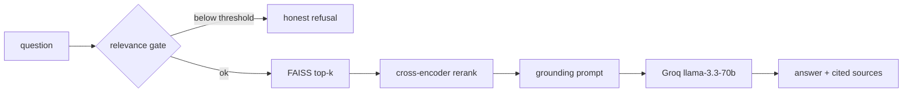

# Python Q&A Assistant

A retrieval-augmented assistant that answers Python questions for data-science
learners, grounded in real Stack Overflow Q&A and served over a FastAPI REST
API. Ask a Python question, get a concise answer with runnable code and links
back to the Stack Overflow questions it was based on. Ask something off-topic
and it tells you it doesn't have a grounded answer instead of making one up.

I built this as a 3-day take-home, so it's deliberately scoped: local
embeddings and a local vector store (zero external infra beyond the LLM), one
clean RAG pipeline, and honest refusal behaviour rather than a sprawling demo.

## Architecture



The flow is: embed the question, check it actually matches something in the
index (refuse if not), retrieve broadly with the bi-encoder, rerank precisely
with a cross-encoder, stuff the top passages into a grounding prompt, and let
the LLM answer with citations.

## Stack

| Layer | Choice |
|---|---|
| Embeddings | `BAAI/bge-small-en-v1.5` (local, sentence-transformers) |
| Vector store | FAISS, persisted to disk |
| Reranker | `cross-encoder/ms-marco-MiniLM-L-6-v2` |
| LLM | Groq `llama-3.3-70b-versatile` |
| Orchestration | LangChain (LCEL) |
| API | FastAPI + uvicorn (async) |
| Cache | `cachetools` TTL cache |

Every model and knob is configurable via `.env` (see `.env.example`).

## Quickstart

```bash
python -m venv .venv && source .venv/bin/activate
pip install -r requirements.txt
cp .env.example .env   # then put your GROQ_API_KEY in it
```

Get a free Groq key at https://console.groq.com.

The repo ships a small prebuilt index (`data/faiss_index/`), so you can run the
API straight away:

```bash
uvicorn app.main:app --reload
curl localhost:8000/health
curl -X POST localhost:8000/ask -H 'Content-Type: application/json' \
  -d '{"question":"how do I reverse a list in python"}'
```

### Rebuilding the index from scratch

The index is built offline from the Stack Overflow Python dataset on Kaggle.

1. Get a Kaggle API token (https://www.kaggle.com/settings -> Create New API
   Token) and put `kaggle.json` at `~/.kaggle/kaggle.json`.
2. Download and process:

```bash
python -m scripts.download_data        # ~1.7 GB into data/raw/
python -m app.rag.ingest               # -> data/processed/corpus.parquet
python -m scripts.build_index          # -> data/faiss_index/
```

`INDEX_MAX_DOCS` caps how many Q/A pairs go into the index. The committed demo
index uses `INDEX_MAX_DOCS=150` so it builds in seconds and ships in the repo;
set it to `0` to index the full ~50k-pair corpus.

### Tests

```bash
pytest                       # unit tests, LLM mocked, no network
RUN_INTEGRATION=1 pytest     # also hits the real Groq chain
```

## Design decisions

- **FAISS over a hosted vector DB.** The corpus fits comfortably in memory and I
  wanted zero external dependencies for the demo. Swapping to Qdrant/Pinecone is
  a retriever-level change, not a rewrite.
- **Local bge-small embeddings.** Free, fast on CPU, and good enough that the
  reranker does the precision work. bge wants a query-side instruction prefix,
  which the embedding wrapper adds on the query path only.
- **Cross-encoder rerank is the main quality lever.** Retrieve broad (top-8),
  rerank precise (top-4). The cross-encoder sees the full (query, passage) pair,
  so it orders results far better than cosine alone.
- **A real relevance gate, not vibes.** Before calling the LLM I score the
  question against the index and refuse below a cosine threshold. bge-small has a
  high cosine floor (off-topic still scores ~0.5-0.6), so the threshold sits in
  the gap above that. This is what makes refusal honest rather than the model
  being asked nicely not to hallucinate.
- **Code blocks are preserved as fenced markdown** through cleaning and chunking.
  For a Python assistant, flattening code into prose throws away most of the
  value, so this got real attention in `ingest.py`.
- **TTL cache keyed on the normalised question.** Learners ask the same things;
  repeat questions return instantly (~1ms vs ~12s cold). It's also the first
  lever for handling concurrency.

## Known limitations

- The committed demo index is only **150 questions** (top by score), so library
  coverage is thin — pandas questions, for instance, get refused because there
  simply aren't pandas docs in that slice. The full corpus fixes this; it's an
  index-size choice, not a pipeline bug. See `notebooks/eval.md`.
- The relevance threshold is tuned to the small index and would need re-tuning
  for the full one.
- Highest-scored answer is a proxy for "accepted" — the raw dataset doesn't
  carry the accepted flag cleanly.
- The top-voted answer can be dated (e.g. a Python-2-era dict-merge trick),
  because it's faithfully grounded in what the source actually says.
- CORS is wide open for the demo.
- `top_k` is accepted in the request body but not yet wired into the retriever.

## What I'd do with more time

- Build and ship the full ~50k index (or host it on the HF Hub and pull at
  startup) and re-tune the gate.
- Add a small offline eval set with retrieval metrics (hit@k, MRR) so threshold
  and chunking changes are measured, not eyeballed.
- A light query-rewrite step for one-word questions like "decorators".
- Prefer newer answers when scores are close, to avoid dated idioms.
- Redis cache + multiple workers for real concurrency (see the scaling notes).

## Test results

`pytest`: 10 passed, 1 skipped (the integration test that needs a live key).
Full query-by-query evaluation with transcripts and the documented failure case
is in [notebooks/eval.md](notebooks/eval.md).

## Deployment (Hugging Face Spaces, Docker)

The `Dockerfile` targets HF Spaces (Docker SDK): it bakes the embedding and
reranker models into the image and serves uvicorn on port 7860. The small index
ships in the repo, so the container has something to load with no runtime
download.

To deploy:
1. Create a new Space (SDK: Docker).
2. Add the HF Space README frontmatter (`sdk: docker`, `app_port: 7860`).
3. Set `GROQ_API_KEY` as a Space secret.
4. Push the repo; the health check path is `/health`.

> Live demo URL: _to be added once deployed._

## API

- `POST /ask` — `{ "question": str }` -> `{ answer, sources[], latency_ms }`
- `GET /health` — model, embedding model, index status, vector count
